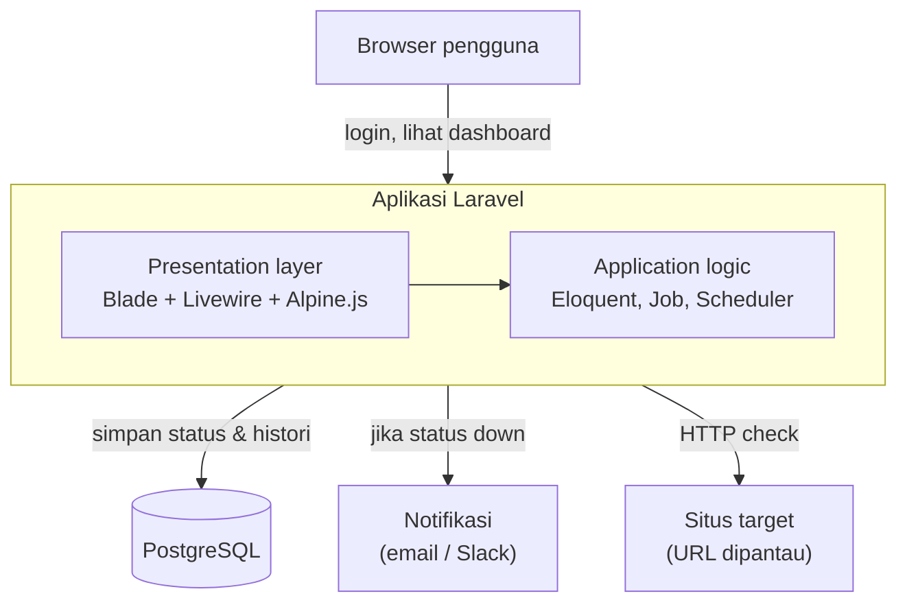
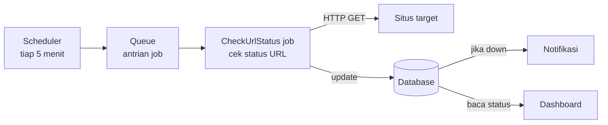

# Design doc: personal uptime monitor

**Tanggal**: 2026-08-24
**Status**: Disetujui — siap masuk fase scaffolding

## 1. Ringkasan

Website personal untuk memantau uptime sejumlah URL. Sistem melakukan pengecekan berkala secara otomatis, mencatat setiap perubahan status (up/down) sebagai insiden, mengirim notifikasi saat status berubah jadi down, dan menampilkan semuanya lewat dashboard yang dilindungi login.

Bukan produk SaaS multi-tenant — ini alat pribadi untuk memantau URL milik sendiri.

## 2. Tech stack

| Layer | Pilihan | Alasan |
|---|---|---|
| Backend framework | Laravel 11/12 (PHP ≥ 8.2) | Ekosistem lengkap (scheduler, queue, notification) yang pas untuk kebutuhan ini |
| ORM | Eloquent | Default Laravel, relasi antar tabel expressive |
| Database | PostgreSQL | Pilihan user, didukung penuh oleh Eloquent tanpa perubahan logic |
| UI server-driven | Livewire | Reactive component tanpa nulis JS terpisah |
| UI client-side ringan | Alpine.js | Ikut ter-bundle di Livewire v3, dipakai untuk interaksi murni UI (modal, toggle) |
| Auth | Laravel Breeze (stack Livewire) | Starter kit resmi, konsisten dengan komponen Livewire lainnya |
| Queue | Database driver | Cukup untuk skala personal, tanpa infra tambahan. Migrasi ke Redis tinggal ganti `QUEUE_CONNECTION` bila skala naik |
| Scheduler | Laravel Scheduler + cron OS | Native, satu entry cron cukup untuk semua job terjadwal |
| HTTP client | `Http` facade | Untuk melakukan ping/cek status ke URL target |
| Notifikasi | Laravel Notification (mail, dapat diperluas ke Slack) | Multi-channel dari satu class |
| Dev environment | Laravel Herd / Laravel Sail | Setup cepat untuk pengembangan lokal |
| Deployment (rencana) | Laravel Cloud | Native support queue worker & scheduler tanpa setup Supervisor/cron manual; Postgres managed tersedia |

## 3. Arsitektur / system design

Aplikasi monolith — satu codebase Laravel yang menghasilkan HTML lewat Blade + Livewire, tidak ada frontend app terpisah.

### Alur pengecekan berkala

## 4. Data model

**`users`** (dari Breeze) — akun login untuk akses dashboard.

**`monitors`** — daftar URL yang dipantau, menyimpan status *terkini* saja.
- `id`
- `name`
- `url`
- `expected_status` (default `200`)
- `is_up` (boolean, default `true`)
- `last_checked_at` (nullable timestamp)

**`incidents`** — histori setiap kali status berubah. Dipisah dari `monitors` supaya kartu "insiden terbaru" di dashboard bisa query cepat tanpa scan seluruh log cek.
- `id`
- `monitor_id` (FK → `monitors`)
- `status` (`down` / `recovered`)
- `detected_at`
- `resolved_at` (nullable)
- `note` (nullable, mis. pesan error/timeout)

Relasi: `Monitor hasMany Incident`, `Incident belongsTo Monitor`.

## 5. Komponen inti

- **`CheckAllMonitors`** — dispatcher, diambil dari scheduler, ambil semua `Monitor` dan dispatch job cek untuk masing-masing ke queue (paralel, tidak blocking).
- **`CheckUrlStatus`** (`ShouldQueue`) — job per-monitor: request HTTP ke `url`, bandingkan status code dengan `expected_status`.
  - Up → Down: update `is_up`, buat record `Incident` baru, kirim notifikasi.
  - Down → Up: update `is_up`, isi `resolved_at` pada incident yang masih terbuka.
- **`UrlDownNotification`** — dikirim dari dalam job saat transisi up→down.
- **Dashboard (Livewire component)** — baca `Monitor::all()` dan `Incident::latest()`, di-poll berkala untuk update tanpa reload manual.

## 6. Error handling

- Request HTTP ke situs target diberi timeout eksplisit (mis. 10 detik) supaya job tidak menggantung kalau target tidak responsif.
- Kegagalan job (exception, bukan sekadar status down) masuk ke mekanisme `failed_jobs` bawaan Laravel — bisa di-retry manual, bukan dianggap sebagai "situs down".
- Perbedaan penting: *situs down* (dicatat sebagai insiden) vs *job gagal dieksekusi* (masalah di sisi worker/queue) ditangani terpisah supaya insiden yang dicatat akurat.

## 7. Testing

- **Unit test**: logic transisi status (`up→down`, `down→up`) pada `CheckUrlStatus`, mock HTTP response.
- **Feature test**: dispatcher `CheckAllMonitors` men-dispatch job untuk tiap monitor yang ada.
- **Feature test**: notifikasi terkirim saat transisi ke down, tidak terkirim saat status tidak berubah.
- Autentikasi dashboard (redirect ke login bila belum auth) di-cover oleh test bawaan starter kit Breeze.

## 8. Rencana deployment

- **Sekarang**: pengembangan lokal (Laravel Herd/Sail), database PostgreSQL lokal.
- **Nanti**: Laravel Cloud — deploy lewat git push (tanpa Dockerfile), queue worker & scheduler otomatis dikelola platform, Postgres managed tersedia satu klik. Redis managed juga tersedia untuk provisioning kalau nanti pindah queue driver.
- Perlu dicek ulang mendekati waktu deploy: detail plan/pricing Laravel Cloud terkini di `cloud.laravel.com/docs/pricing`, karena platform ini masih relatif baru dan strukturnya bisa berubah.

## 9. Di luar cakupan (out of scope untuk versi ini)

- Multi-user / multi-tenant (tiap user punya monitor sendiri-sendiri).
- Channel notifikasi selain email di versi awal (Slack/Telegram bisa ditambah belakangan tanpa ubah arsitektur).
- Status page publik (halaman yang bisa diakses orang lain untuk lihat uptime).
